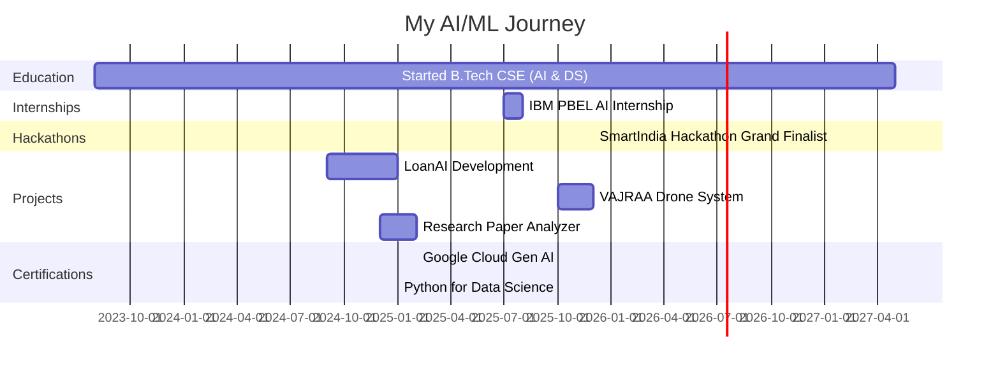

<div align="center">
  
</div>

<div align="center">
  
</div>

<br>

<div align="center">
  
### 🚀 **Quick Summary**

[](https://github.com/sanju234-san)
[](#)
[](#)
[](https://github.com/sanju234-san)
[](#)

**AI Engineer** building production-ready ML systems | **YOLOv8 Expert** | **RAG Architect** | **Open Source Contributor**

📍 Delhi, India | 🎓 B.Tech CSE (AI & DS) @ SRM University | 📧 sanjeevnidhir05@gmail.com

</div>

<br>

<div align="center">
  
</div>

<br>

## 🎭 **Who Am I?**


```yaml
name: Sanjeevni Dhir
role: AI Engineer & Full Stack Developer
location: Delhi, India
education: B.Tech CSE with Data Science and AI
university: SRM University NCR Campus (2023-2027)

career_objective: |
  Passionate AI and Data Science undergraduate specializing in 
  Machine Learning, Deep Learning, and Large Language Models (LLMs).
  Building end-to-end AI solutions including Generative AI systems,
  RAG pipelines, and scalable data-driven applications.
  
focus_areas:
  - Machine Learning & Deep Learning
  - Large Language Models & RAG Pipelines
  - Computer Vision & Image Processing
  - Generative AI & Prompt Engineering
  
achievements:
  - SmartIndia Hackathon 2025 Grand Finalist (Top 0.1%)
  - IBM PBEL Virtual Internship (AI)
  - Open Source Contributor (200+ contributions)
  - 5+ Production ML Projects
  
current_stats:
  - projects_shipped: 5
  - model_accuracy: "95%+"
  - github_contributions: "200+"
  - certifications: 4
  
motto: "Turning complex AI research into real-world solutions"
```

<br clear="right"/>

---

## 📊 **Impact Metrics**

<div align="center">

<table>
<tr>
<td align="center" width="25%">
<br>
<h3>95%+</h3>
<p>ML Model Accuracy</p>
</td>
<td align="center" width="25%">
<br>
<h3>5+</h3>
<p>Production Projects</p>
</td>
<td align="center" width="25%">
<br>
<h3>200+</h3>
<p>GitHub Contributions</p>
</td>
<td align="center" width="25%">
<br>
<h3>Top 0.1%</h3>
<p>SIH 2025 Finalist</p>
</td>
</tr>
</table>

</div>

---

## 🎯 **Technical Expertise Matrix**

<div align="center">

| Skill Category | Technologies | Proficiency | Projects |
|:---|:---|:---:|---:|
| **Machine Learning** | scikit-learn, XGBoost, Ensemble Methods | ⭐⭐⭐⭐⭐ | LoanAI, Spam Detection |
| **Deep Learning** | TensorFlow, Keras, PyTorch, CNNs | ⭐⭐⭐⭐⭐ | VAJRAA, Image Classifier |
| **Computer Vision** | YOLOv8, OpenCV, Image Processing | ⭐⭐⭐⭐⭐ | VAJRAA Drone System |
| **LLM & RAG** | GPT, Llama 3, Embeddings, Vector DBs | ⭐⭐⭐⭐⭐ | Research Paper Analyzer |
| **NLP** | TF-IDF, BERT, Text Classification | ⭐⭐⭐⭐ | DocClassify, Spam Detection |
| **Full Stack** | React, FastAPI, REST APIs | ⭐⭐⭐⭐ | All Projects |
| **Cloud & DevOps** | IBM Cloud, Google Cloud, Git | ⭐⭐⭐⭐ | Production Deployments |
| **Data Engineering** | MongoDB, MySQL, Vector DBs | ⭐⭐⭐⭐ | Data Pipelines |

</div>

---

## 🔬 **Current Research & Development**

<table>
<tr>
<td width="50%">

### 🤖 **Agentic AI Systems**
Building intelligent agents that:
- 🎯 Use tools autonomously
- 🧩 Break down complex problems
- 🔄 Learn from multi-step reasoning
- 🎪 Orchestrate multiple AI models

**Stack**: LangChain, Vector DBs, Custom Agents

</td>
<td width="50%">

### 📚 **RAG Architecture**
Creating next-gen retrieval systems:
- 🔍 Smart document chunking strategies
- 💾 Optimized vector embeddings
- 🎯 Context-aware retrieval
- ⚡ Low-latency query processing

**Stack**: Embeddings, ChromaDB, Pinecone

</td>
</tr>
</table>

<div align="center">
  
</div>

---

## 🛠️ **TECH STACK & EXPERTISE**

<div align="center">

### **🤖 ARTIFICIAL INTELLIGENCE & MACHINE LEARNING**

<table>
<tr>
<td align="center" width="20%">

<br><strong>Python</strong>
</td>
<td align="center" width="20%">

<br><strong>TensorFlow</strong>
</td>
<td align="center" width="20%">

<br><strong>Keras</strong>
</td>
<td align="center" width="20%">

<br><strong>Scikit-Learn</strong>
</td>
<td align="center" width="20%">

<br><strong>YOLOv8</strong>
</td>
</tr>
</table>

**🔥 Core ML Capabilities**


<br>

### **📊 DATA SCIENCE & ANALYTICS**

<table>
<tr>
<td align="center" width="20%">

<br><strong>NumPy</strong>
</td>
<td align="center" width="20%">

<br><strong>Pandas</strong>
</td>
<td align="center" width="20%">

<br><strong>Matplotlib</strong>
</td>
<td align="center" width="20%">

<br><strong>Seaborn</strong>
</td>
<td align="center" width="20%">

<br><strong>OpenCV</strong>
</td>
</tr>
</table>


<br>

### **⚡ BACKEND & API DEVELOPMENT**

<table>
<tr>
<td align="center" width="20%">

<br><strong>FastAPI</strong>
</td>
<td align="center" width="20%">

<br><strong>MongoDB</strong>
</td>
<td align="center" width="20%">

<br><strong>Node.js</strong>
</td>
<td align="center" width="20%">

<br><strong>MySQL</strong>
</td>
<td align="center" width="20%">

<br><strong>Postman</strong>
</td>
</tr>
</table>


<br>

### **🎨 FRONTEND & WEB DEVELOPMENT**

<table>
<tr>
<td align="center" width="16.66%">

<br><strong>React</strong>
</td>
<td align="center" width="16.66%">

<br><strong>JavaScript</strong>
</td>
<td align="center" width="16.66%">

<br><strong>HTML5</strong>
</td>
<td align="center" width="16.66%">

<br><strong>CSS3</strong>
</td>
<td align="center" width="16.66%">

<br><strong>Tailwind CSS</strong>
</td>
<td align="center" width="16.66%">

<br><strong>Bootstrap</strong>
</td>
</tr>
</table>


<br>

### **🔧 TOOLS & PLATFORMS**

<table>
<tr>
<td align="center" width="16.66%">

<br><strong>GitHub</strong>
</td>
<td align="center" width="16.66%">

<br><strong>Git</strong>
</td>
<td align="center" width="16.66%">

<br><strong>VS Code</strong>
</td>
<td align="center" width="16.66%">

<br><strong>Jupyter</strong>
</td>
<td align="center" width="16.66%">

<br><strong>Google Cloud</strong>
</td>
<td align="center" width="16.66%">

<br><strong>IBM Cloud</strong>
</td>
</tr>
</table>


<br>

### **🔮 LLM & GENERATIVE AI**

<table>
<tr>
<td align="center" width="20%">

<br><strong>ChatGPT</strong>
</td>
<td align="center" width="20%">

<br><strong>Google Gemini</strong>
</td>
<td align="center" width="20%">

<br><strong>Claude</strong>
</td>
<td align="center" width="20%">

<br><strong>Llama 3</strong>
</td>
<td align="center" width="20%">

<br><strong>LangChain</strong>
</td>
</tr>
</table>


</div>

---

## 🏆 **Achievements & Recognition**

<div align="center">

### 🥇 **SmartIndia Hackathon (SIH) 2025 - Grand Finalist**

**Hardware Edition** | Ministry of Education, Government of India

Demonstrated strong problem-solving and analytical thinking while contributing to real-time obstacle detection for autonomous systems

📍 Gunupur, Odisha | December 2025

</div>

---

## 💼 **Professional Experience**

<table>
<tr>
<td>

### 🔹 **IBM PBEL Virtual Internship**
**Artificial Intelligence (via FSP)** | IBM  
📅 July 2025 – August 2025 (6 Weeks Equivalent)

**Key Contributions:**
- 🤖 Built a CNN image classifier (Dogs vs Cats) using TensorFlow on IBM Cloud
- ☁️ Gained hands-on exposure to AI deployment and evaluation workflows
- 📊 Worked with cloud-based AI infrastructure and model deployment

</td>
</tr>
</table>


---


## 📜 **Certifications & Training**

<div align="center">

| Certification | Issuer | Date |
|:---|:---:|---:|
| 🎓 **Introduction to Generative AI** | Google Cloud | Feb 2025 |
| 🐍 **Python 101 for Data Science** | SRM (Skills Network) | Jan 2025 |
| 📊 **Data Analytics & Visualization Job Simulation** | Accenture | Aug 2024 |
| 🐍 **Python Certification** | GUVI (HCL) | Jul 2024 |

</div>

---

## 🌐 **Open Source Contributions**

<table>
<tr>
<td width="50%">

### 🇮🇳 **Open Source Connect India**
**April 2025 – September 2025**

- 🔧 Resolved issues and enhanced features
- 📝 Improved documentation
- 🤝 Collaborated with developers across India
- ✅ Followed best practices in version control and code reviews

</td>
<td width="50%">

### 🌍 **Open Source Connect Global**

- 🌎 Actively engaged with global developer community
- 💻 Contributed to international open-source projects
- 📚 Followed clean coding standards
- 🔄 Participated in peer code reviews

</td>
</tr>
</table>

---

## 💪 **Core Skills**

<div align="center">
  
<table>
<tr>
<td align="center" width="25%" style="border: none;">
<br>
<div style="background: linear-gradient(135deg, #667eea 0%, #764ba2 100%); padding: 20px; border-radius: 15px;">
<br><br>
<h3 style="color: white;">Machine Learning</h3>
<p style="color: #e0e0e0;">End-to-End ML Solutions</p>
</div>
</td>
<td align="center" width="25%" style="border: none;">
<br>
<div style="background: linear-gradient(135deg, #f093fb 0%, #f5576c 100%); padding: 20px; border-radius: 15px;">
<br><br>
<h3 style="color: white;">LLM & RAG</h3>
<p style="color: #e0e0e0;">Implementation & Optimization</p>
</div>
</td>
<td align="center" width="25%" style="border: none;">
<br>
<div style="background: linear-gradient(135deg, #4facfe 0%, #00f2fe 100%); padding: 20px; border-radius: 15px;">
<br><br>
<h3 style="color: white;">Computer Vision</h3>
<p style="color: #e0e0e0;">YOLOv8 & Image Processing</p>
</div>
</td>
<td align="center" width="25%" style="border: none;">
<br>
<div style="background: linear-gradient(135deg, #43e97b 0%, #38f9d7 100%); padding: 20px; border-radius: 15px;">
<br><br>
<h3 style="color: white;">Full Stack Development</h3>
<p style="color: #e0e0e0;">FastAPI + React</p>
</div>
</td>
</tr>
</table>

</div>


</div>

### 🔧 **Development Practices**

<div align="center">


</div>

---

## 📊 **What Sets Me Apart**

<div align="center">

<table>
<tr>
<td align="center" width="33%">

<br><br>
<h3>🎯 Problem Solver</h3>
<p><b>95%+ Accuracy</b> in ML models<br>
Optimized systems for <b>real-time</b> performance<br>
Built scalable solutions from <b>0 to 1</b></p>
</td>
<td align="center" width="33%">

<br><br>
<h3>🚀 Fast Learner</h3>
<p>Mastered <b>YOLOv8</b> in 2 weeks<br>
Built production <b>RAG</b> pipeline in 1 month<br>
<b>SIH Grand Finalist</b> in first attempt</p>
</td>
<td align="center" width="33%">

<br><br>
<h3>💡 Innovator</h3>
<p><b>5+ Production</b> projects<br>
Active <b>Open Source</b> contributor<br>
Always learning <b>cutting-edge</b> tech</p>
</td>
</tr>
</table>

</div>

---

## 🏅 **Achievements Timeline**



---

## 🎓 **Continuous Learning**

<div align="center">

### 📚 **Currently Exploring**


### 🎯 **Learning Goals for 2026**

| Quarter | Focus Area | Target |
|:---:|:---|:---|
| Q1 | Advanced LLM Architectures | Build custom LLM agent framework |
| Q2 | MLOps & Model Deployment | Deploy 3+ models to production |
| Q3 | Deep Learning Research | Publish research paper |
| Q4 | System Design & Scale | Build distributed ML system |

</div>

---

## 💻 **Problem Solving & Competitive Programming**

<div align="center">

### 🧩 **Algorithmic Thinking**

<table>
<tr>
<td align="center" width="33%">
<br><br>
<h4>Data Structures & Algorithms</h4>
<p>Strong foundation in DSA<br>
Optimized solutions for complex problems<br>
Time & Space complexity analysis</p>
</td>
<td align="center" width="33%">
<br><br>
<h4>System Design</h4>
<p>Scalable architecture design<br>
Microservices & distributed systems<br>
Database optimization</p>
</td>
<td align="center" width="33%">
<br><br>
<h4>ML System Design</h4>
<p>End-to-end ML pipelines<br>
Model deployment & monitoring<br>
Real-time inference optimization</p>
</td>
</tr>
</table>

</div>

---

## 📈 **GitHub Journey**

<div align="center">
  
  
  
  

</div>

<div align="center">
  
  
  
</div>

<div align="center">
  
</div>

---

## 🎯 **Active Explorations**

<div align="center">

| 🔬 **Learning** | 🛠️ **Building** | 🤝 **Collaborating** |
|:---:|:---:|:---:|
| Advanced LLM Architectures | Agentic AI Frameworks | RAG Pipeline Optimization |
| Vector Database Optimization | Multi-Agent Systems | Open Source AI Projects |
| Neural Network Innovations | Tool-Using AI Agents | Research Implementations |
| Prompt Engineering Mastery | Computer Vision Apps | ML Community Projects |

</div>

---

## 📝 **Technical Writing & Thought Leadership**

<div align="center">

### 💭 **Sharing Knowledge**

I believe in **learning in public** and **giving back to the community**

<table>
<tr>
<td align="center" width="50%">
<br><br>
<h4>📚 Documentation Expert</h4>
<p>• Comprehensive project documentation<br>
• Technical guides & tutorials<br>
• Best practices sharing<br>
• Code examples & snippets</p>
</td>
<td align="center" width="50%">
<br><br>
<h4>🌟 Open Source Philosophy</h4>
<p>• Active contributor to ML projects<br>
• Code reviews & PR feedback<br>
• Issue resolution & bug fixes<br>
• Community engagement</p>
</td>
</tr>
</table>

### 🎯 **Topics I'm Passionate About**


</div>

---

## 🌟 **Let's Build Together**

<div align="center">
  
  I'm actively seeking collaborators for:
  
  🤖 **AI/ML Projects** → Innovative machine learning solutions & research
  
  🔗 **RAG Systems** → Novel retrieval strategies & vector optimization
  
  🌐 **Open Source AI** → Contributing to the community
  
  🔬 **Research Implementations** → Turning papers into production code

</div>

---

## 📬 **Connect & Collaborate**

<div align="center">
  
  <a href="https://linkedin.com/in/sanjeevnidhir">
    
  </a>
  <a href="mailto:sanjeevnidhir05@gmail.com">
    
  </a>
  <a href="https://github.com/sanju234-san">
    
  </a>
  <a href="https://instagram.com/sanjeevni2708">
    
  </a>

</div>

---

## 🎯 **For Recruiters & Hiring Managers**

<div align="center">

### 💼 **Why Choose Me?**

<table>
<tr>
<td width="33%" align="center">
<h3>🚀 Fast Learner</h3>
<p>• Mastered YOLOv8 in 2 weeks<br>
• Built production RAG in 1 month<br>
• Adapts to new tech rapidly<br>
• Self-motivated & independent</p>
</td>
<td width="33%" align="center">
<h3>💡 Problem Solver</h3>
<p>• 95%+ ML model accuracy<br>
• Optimizes for real-time performance<br>
• End-to-end solution architect<br>
• Data-driven decision maker</p>
</td>
<td width="33%" align="center">
<h3>🤝 Team Player</h3>
<p>• Open source contributor<br>
• Excellent communicator<br>
• Collaborative mindset<br>
• Shares knowledge actively</p>
</td>
</tr>
</table>

### 📞 **Let's Talk!**

I'm **actively seeking** internships and full-time opportunities in:


**Available for:** Internships (Summer 2026) | Full-time (Post Graduation 2027) | Part-time Projects

**Expected Graduation:** May 2027 | **Notice Period:** Negotiable

</div>

---

<div align="center">
  
</div>

<div align="center">
  
### 💭 *Philosophy*

**"The best AI systems don't replace human thinking—**  
**they amplify it, one intelligent agent at a time."**


*Currently: Building intelligent systems at IBM PBEL | Learning in public | Documenting everything*

</div>

<br>

<div align="center">
  
### 📫 **Get In Touch**

**💌 Email:** [sanjeevnidhir05@gmail.com](mailto:sanjeevnidhir05@gmail.com)  
**📱 Phone:** +91 9310169588  
**📍 Location:** Delhi, India  
**🌐 Portfolio:** [github.com/sanju234-san](https://github.com/sanju234-san)

**Response Time:** Within 24 hours ⚡

</div>

<br>

<div align="center">
  
</div>

<div align="center">
  
</div>

---

<div align="center">
  <sub>⭐ From <a href="https://github.com/sanju234-san">sanju234-san</a> with 💜 | Powered by curiosity & coffee ☕</sub>
</div>
